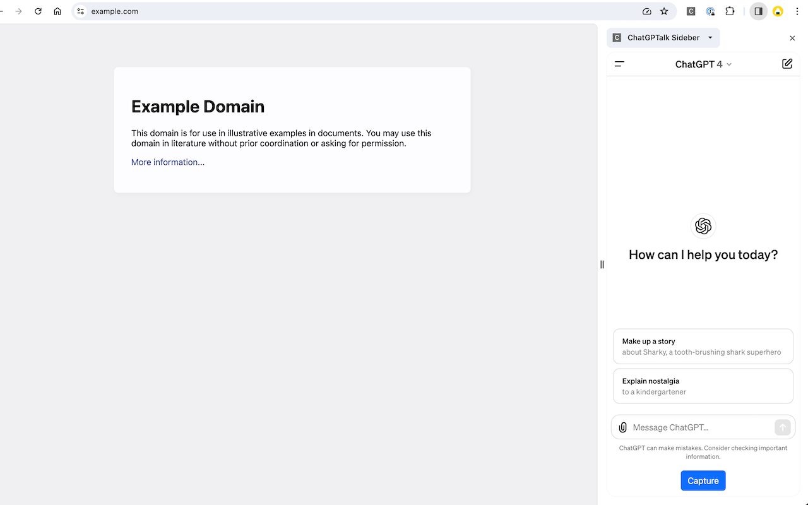

# AiSidebarExtension

A Chrome extension that injects an AI sidebar into web pages.

## Overview

This Chrome extension adds a sidebar to any web page, providing AI assistant features. It is built with Svelte and TypeScript, using Vite as the build tool.



## Main Features

- Open a sidebar on any web page
- Chat with AI (ChatGPT, Gemini, etc.)
- Summarize and analyze page content (planned feature)

## Tech Stack

- **Framework**: Svelte
- **Language**: TypeScript
- **Build Tool**: Vite
- **Extension Plugin**: [@crxjs/vite-plugin](https://crxjs.dev/vite-plugin)
- **UI Framework**: Bootstrap

## Setup & Build

### 1. Install Dependencies

Install dependencies using pnpm in the project root directory.

```bash
pnpm install
```

### 2. Development

Start the development server with hot reload.

```bash
pnpm run dev
```

During development, load the `dist` directory as an unpacked extension from Chrome's extensions page to test the extension.

### 3. Build

Build the extension for production.

```bash
pnpm run build
```

After building, the `dist` directory will contain the unpacked extension files. You can upload these to the Chrome Web Store or load them directly into Chrome.

## Scripts

The main scripts defined in `package.json` are as follows:

- `dev`: Start Vite in development mode.
- `build`: Build the project for production.
- `format`: Format code using Prettier.
- `check`: Run Svelte Check for type checking Svelte components.
